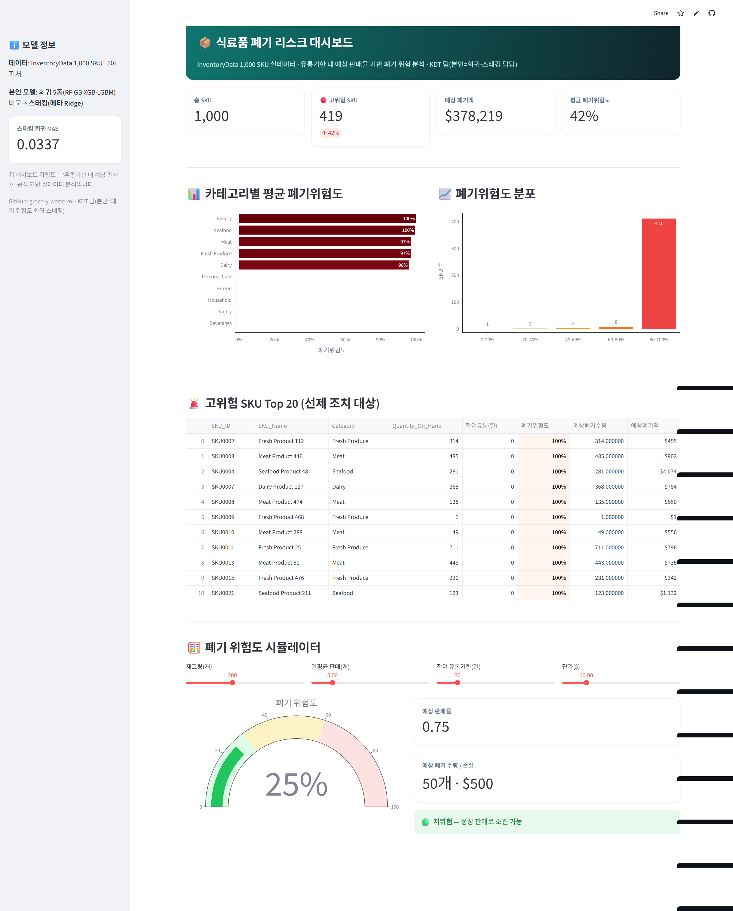
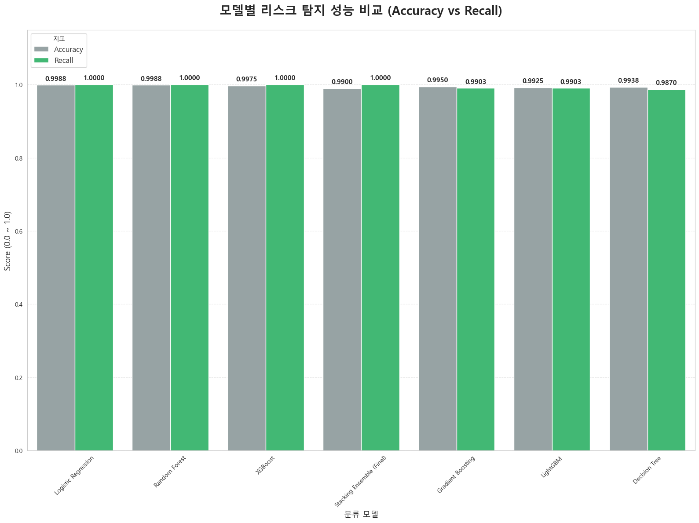
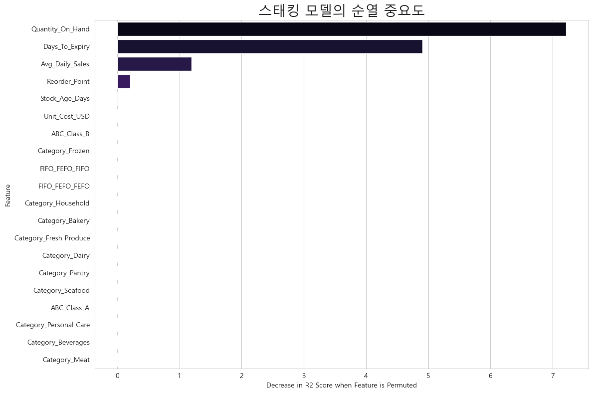
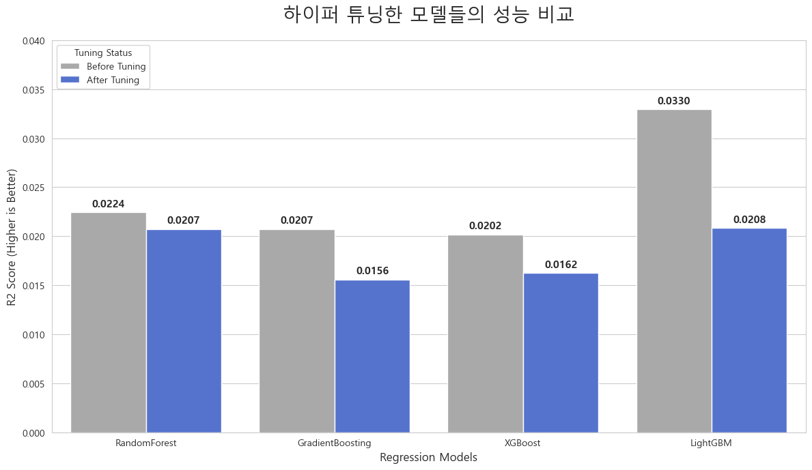

# 📦 식료품 폐기 리스크 예측 (회귀 + 스태킹 앙상블)

[](https://grocery-waste-ml-5fezqfu8kdm8tm69kojv7g.streamlit.app/)

**🖥 [▶️ 라이브 데모 (Streamlit)](https://grocery-waste-ml-5fezqfu8kdm8tm69kojv7g.streamlit.app/)** — 실제 학습 모델로 바로 구동(내장 샘플 포함)



> 재고 데이터로 **'유통기한 내 예상 판매율'을 회귀 예측**해 폐기 위험 제품을 선제 식별한 빅데이터 ML 프로젝트.

| 항목 | 내용 |
|---|---|
| 기간 | 2026.03.03 ~ 2026.03.16 |
| 팀 | 4인 (KDT 팀 프로젝트 · GOOD FIT) |
| **나의 역할** | **폐기 위험도 회귀 + 스태킹 앙상블 담당** |

> ℹ️ KDT 부트캠프 팀 프로젝트입니다. 본 저장소는 **본인의 회귀·스태킹** 작업이며, 재고상태 분류·수요예측은 팀원이 담당했습니다.

---

## 🎯 문제 정의
재고 **1,000+ SKU · 50+ 피처**에서 폐기를 최소화하려면 **위험 제품을 선제 식별**해야 한다. 본인 타깃: **유통기한 내 예상 판매율(낮을수록 폐기 위험)** 회귀.

## 🛠 기술 스택
`Python` · `scikit-learn` · `RandomForest` · `GradientBoosting` · `XGBoost` · `LightGBM` · `Stacking(Ridge)` · `RandomizedSearchCV`

## 🔧 핵심 구현
1. **파생변수 설계** — 재고 소진 소요일수(재고/일판매), 남은 유통기한, 예상 판매율.
2. **회귀 모델 5종 비교** — DecisionTree·RandomForest·GradientBoosting·XGBoost·LightGBM.
3. **하이퍼파라미터 튜닝** — RandomizedSearchCV (n_iter 50~200, 5-fold CV).
4. **스태킹 앙상블** — 4개 베이스(RF·GB·XGB·LGBM) + **메타 모델 Ridge**, 5-fold 결합.
5. **위험 샘플 가중** — 저판매(위험) 샘플에 5배 가중치로 과소예측 방지.

## 🔧 트러블슈팅
| 문제 | 해결 |
|---|---|
| 단일 모델 예측 편차 | 스태킹(메타 Ridge)으로 4개 모델 결합 → 안정화 |
| 고값 구간(100+) 오차 | 구간 분리 분석 |
| 위험 샘플 과소예측 | sample_weight 5배 |
| 앙상블 효과 부족 | 트리·부스팅 등 **이질적 베이스** 구성 |

## 📈 결과
- 스태킹 회귀 **MAE 0.0337**.
- 예측을 할인·동적가격 전략에 연계해 폐기 방어 약 **$59,094** 추정.

## 📊 실험 결과 & 시각화

회귀 모델 5종 비교 → **스태킹 앙상블 채택**:

| 모델 | 비고 |
|---|---|
| RandomForest · GradientBoosting · XGBoost · LightGBM | 단일 모델 (RandomizedSearchCV 튜닝) |
| **★ Stacking (메타: Ridge)** | **MAE 0.0337** — 단일 모델 편차를 결합해 안정화 |

<p>
 
</p>
<p>

</p>

> 좌상: 모델별 성능 · 우상: 피처 중요도 · 좌하: 하이퍼파라미터 튜닝

## 🖥 데모 (Streamlit) — 실데이터 대시보드
**InventoryData.csv(1,000 SKU) 실데이터**를 연동해, SKU별 폐기 위험을 분석하는 대시보드. (KPI·카테고리별 위험·고위험 Top20·시뮬레이터)
```bash
pip install -r requirements.txt
streamlit run app.py
```

## 📁 구조
```
app.py                        # 폐기 리스크 대시보드 (실데이터 1,000 SKU)
data/InventoryData.csv        # 재고 데이터 (앱이 로드)
waste_risk_regression.ipynb   # 본인 작업: 파생변수·5모델 비교·튜닝·스태킹 전 과정
assets/                       # 실험 결과 이미지
requirements.txt
```
> 발표자료(PPTX/PDF)는 용량 관계로 제외. 모델 학습 과정은 노트북에 포함.
